# Concept of a Quantum Random Number Generator
- A quantum random number generator uses the fact that measuring a qubit in superposition yields an inherently unpredictable outcome.
- In traditional computers, we have either 2 States: 0 or 1. But in Quantum computers we can have 3 States: 0, 1 or superposition of both 0 and 1.

- Implemented Code from Scratch: hadamard, pauli_z, zero_state, apply_gate, measure, quantum_random_bit, quantum_random_number

## TO  SEE THE CODE
open `src/QRNG.py`, you will see the `QRandom` class with code for hadamard, pauli_z, zero_state, apply_gate, measure, quantum_random_bit, quantum_random_number. 

## Implement Hadamard as a matrix
1. an Hadamard matrix, named after the French mathematician Jacques Hadamard, is a square matrix whose entries are either +1 or −1 and whose rows are mutually orthogonal.
2. The Hadamard gate, derived from the Hadamard matrix, is a fundamental one-qubit gate that transforms a qubit into a superposition of the |0⟩ and |1⟩ states.

The Hadamard gate is defined as:
    $$
        H = \frac{1}{\sqrt{2}}
        \begin{pmatrix}
        1 & 1 \\
        1 & -1
        \end{pmatrix}
    $$

``` python
    @staticmethod
    def hadamard():
        """ 
        Returns the 2x2 Hadamard matrix.
        """
        return (1/np.sqrt(2) * np.array([[1,1], [1,-1]]))
```

If a qubit is in state

$$
|0\rangle = 
\begin{pmatrix}
1 \\
0
\end{pmatrix},
$$

``` python
    @staticmethod
    def zero_state():
        """
        |0⟩ : Zero State - lowest energy state for a qubit
        """
        return np.array([[1], [0]], dtype=complex)
```

then applying the Hadamard gate gives:
$$
H|0\rangle = \frac{1}{\sqrt{2}}
\begin{pmatrix}
1 & 1 \\
1 & -1
\end{pmatrix}
\begin{pmatrix}
1 \\
0
\end{pmatrix}
=
\frac{1}{\sqrt{2}}
\begin{pmatrix}
1 \\
1
\end{pmatrix}.
$$

``` python
    @staticmethod
    def apply_gate(state, gate):
        """
        returns the dot product of gate, and a state. Mostly zero_state and hadamard matrix.
        """
        return np.dot(zero_state, hadamard)
```


## Minimal Circuit
1. Start with qubit (A quantum state) $$ |0\rangle $$ 
2. Apply Hadamard (H) which produces equal superposition
    $$ |\psi\rangle = \frac{1}{\sqrt{2}}\left(|0\rangle + |1\rangle\right) $$
3. Measure the qubit which returns `0` or `1` with 50-50 probability.

## Result

1. Real Quantum Computer: `ibm_torino`
2. Number of Epoch: 5 (Due to lack of Quantum Computer Availability)

### Conclusion

1. Pseudo Random: It converges to a single points, and are not truly random from out graphs.
2. Simulated    : It does have a uniform speration.
3. Quantum      : for 5 points, we can see it converges to right side, but though its truly random.

| Pseudo Random             |  Simulated | Real Quantum Computer |
:-------------------------:|:-------------------------: | :-------------------------:
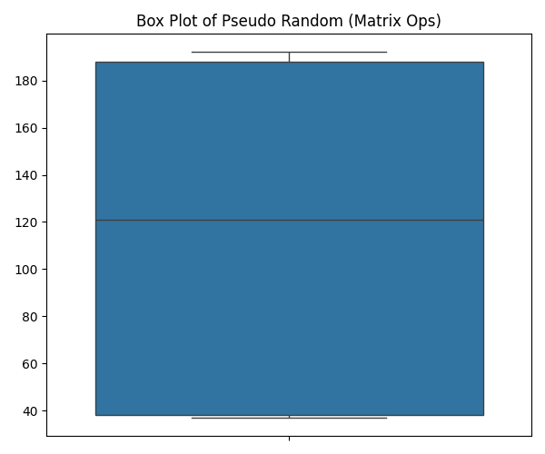 | 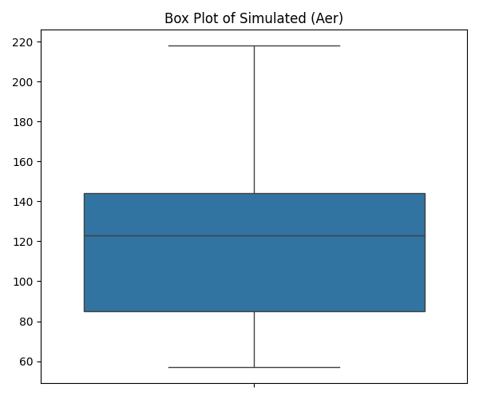 | 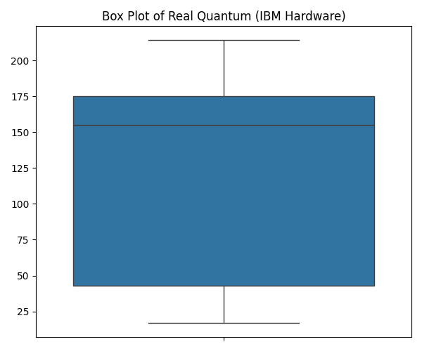
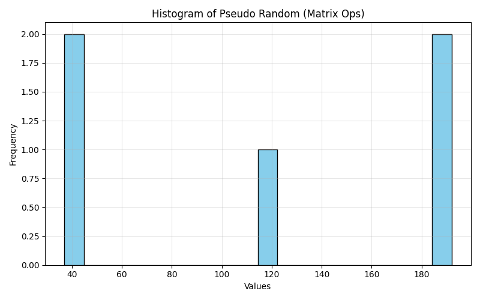 | 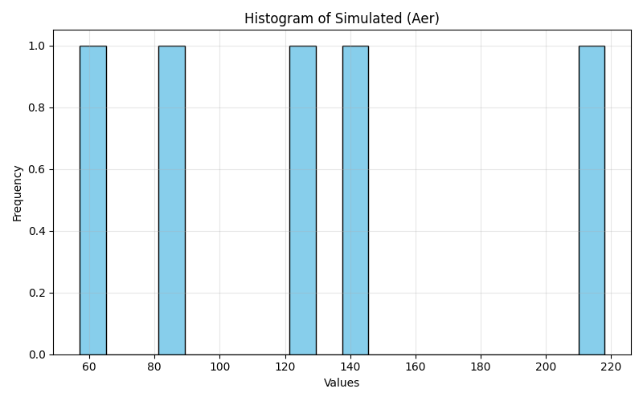 | 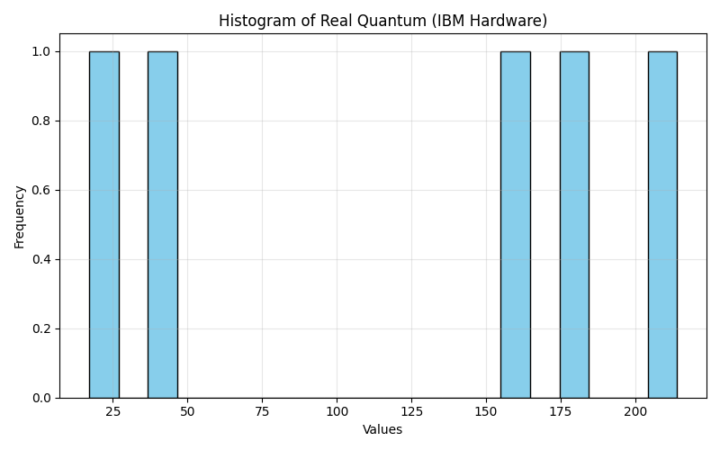
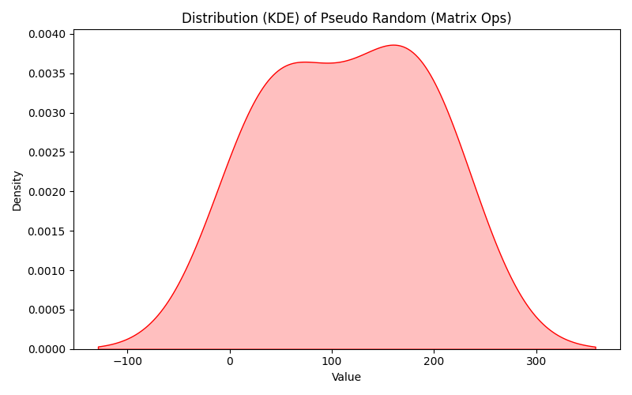 | 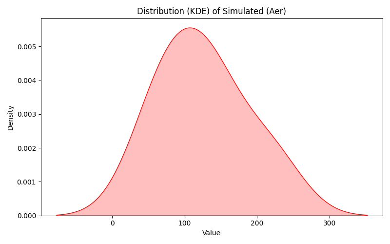 | 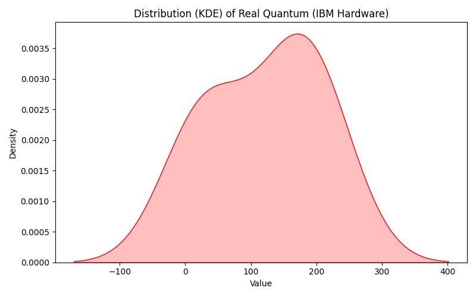
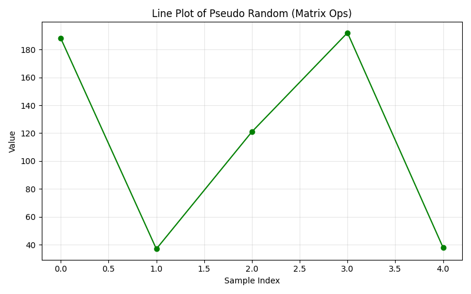 | 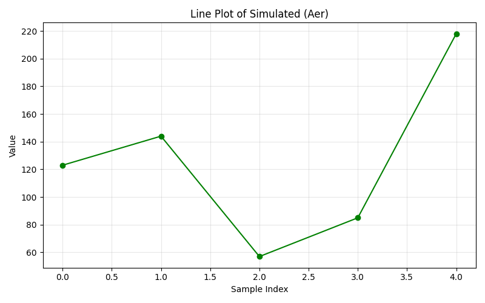 | 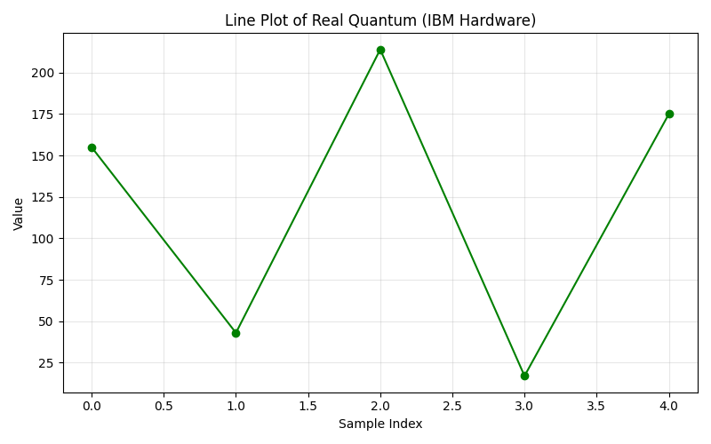
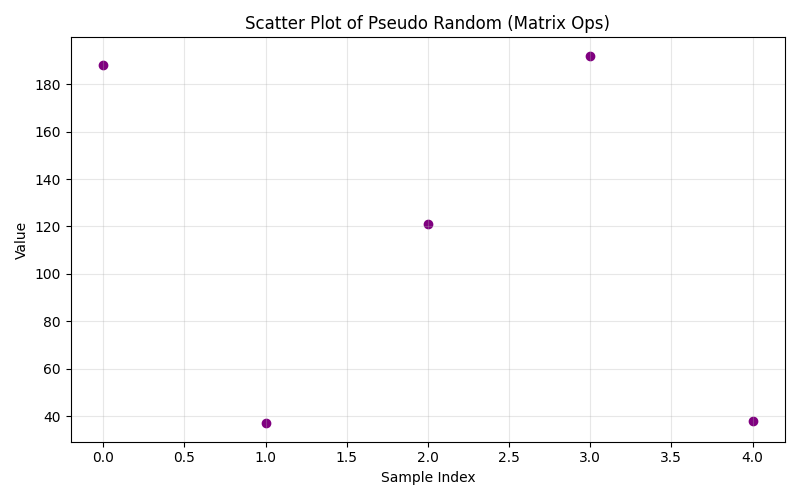 | 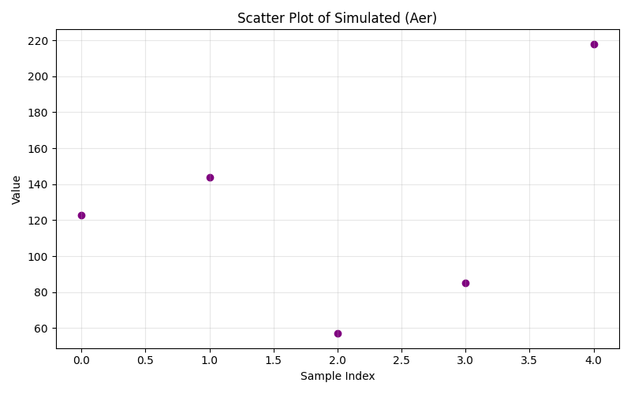 | 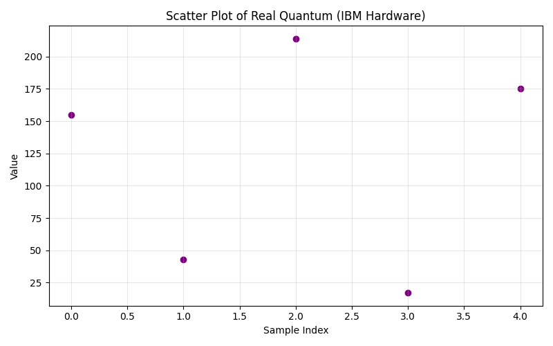


## My QRandom Class
``` python
from qiskit import QuantumCircuit, transpile
from qiskit_aer import AerSimulator
from qiskit_ibm_runtime import QiskitRuntimeService, SamplerV2
from qiskit.transpiler.preset_passmanagers import generate_preset_pass_manager

import numpy as np

class QRandom:
    @staticmethod
    def hadamard():
        """ 
        Returns the 2x2 Hadamard matrix.
        """
        return (1/np.sqrt(2) * np.array([[1,1], [1,-1]]))

    @staticmethod
    def pauli_z():
        """
        Pauli-Z gate (for measurement in computational basis)
        """
        return np.array([[1,0], [0, -1]])
    
    @staticmethod
    def zero_state():
        """
        |0⟩ : Zero State - lowest energy state for a qubit
        """
        return np.array([[1], [0]], dtype=complex)
    
    @staticmethod
    def apply_gate(state, gate):
        """
        returns the dot product of gate, and a state. Mostly zero_state and hadamard matrix.
        """
        return np.dot(gate, state)
    
    @staticmethod
    def measure(state):
        """
        Measures a single qubit in computational basis.
        Returns 0 or 1 randomly according to probabilities.
        """

        prob_0 = np.abs(np.pow(state[0,0],2))
        prob_1 = np.abs(np.abs(np.pow(state[1,0],2)))

        return np.random.choice([0,1], p=[prob_0, prob_1])
    
    @staticmethod
    def quantum_random_bit(method="simulate", backend_name=None, api_key=None, instance_id=None):
        """
        Generate a random bit.

        method: "simulate" or "real" or "pseudo-random"
        backend_name: for real devices, name of IBMQ backend
        """

        if method == "pseudo-random":
            # Start in |0>
            state = QRandom.zero_state()

            # Apply Hamarad gate to create superposition
            state = QRandom.apply_gate(state, QRandom.hadamard())

            # Measure the qubit
            return QRandom.measure(state)
        elif method == "simulate":
            simulator = AerSimulator()
            qc = QuantumCircuit(1,1)
            qc.h(0)
            qc.measure(0,0)
            tqc = transpile(qc, simulator)
            job = simulator.run(tqc, shots=1)
            result = job.result()
            counts = result.get_counts()
            return int(list(counts.keys())[0], 2)
        elif method == "real":
            service = QiskitRuntimeService(token=api_key, instance=instance_id, channel="ibm_quantum_platform")
            backend = service.backend(backend_name)
            sampler = SamplerV2(mode=backend)

            qc = QuantumCircuit(1,1)
            qc.h(0) 
            qc.measure(0,0)

            pman = generate_preset_pass_manager(optimization_level=1, backend=backend)
            isa_qc = pman.run(qc)

            job = sampler.run([isa_qc], shots=1)
            result = job.result()

            counts = result[0].data.c.get_counts()
            bit = int(list(counts.keys())[0])
            return bit
    
    @staticmethod
    def quantum_random_number(n_bits=8, method="simulate", backend_name=None, api_key=None, instance_id=None):
        """
        Generates a random integer with n_bits using Quantum Random Bit

        method: "simulate" or "real" or "pseudo-random"
        backend_name: for real devices, name of IBMQ backend
        """

        bits = [str(QRandom.quantum_random_bit(method, backend_name=backend_name, api_key=api_key, instance_id=instance_id)) for _ in range(n_bits)]
        return int("".join(bits), 2)
```

## To Run the Code
1. Install Python 3.12
2. Clone this git repository
3. Change the directory to the cloned repo
4. RUN: `python -m venv venv` to create a virtual environment
5. RUN: `Set-ExecutionPolicy Bypass -Scope Process` if you have not permission for step 6.
6. RUN: `.\/venv/Scripts/Activate.ps1` to activate the virtual environment.
7. RUN: `pip install -r requirements.txt` to install required libraries like qiskit, matplotlib, ...
8. RUN: `python main.py` or `python3 main.py` but do add API KEYS, Instance ID and QPU Machine Information, else comment the code.
9. Thank you!

## Thank you for reading. All hail Quantum Computers!
